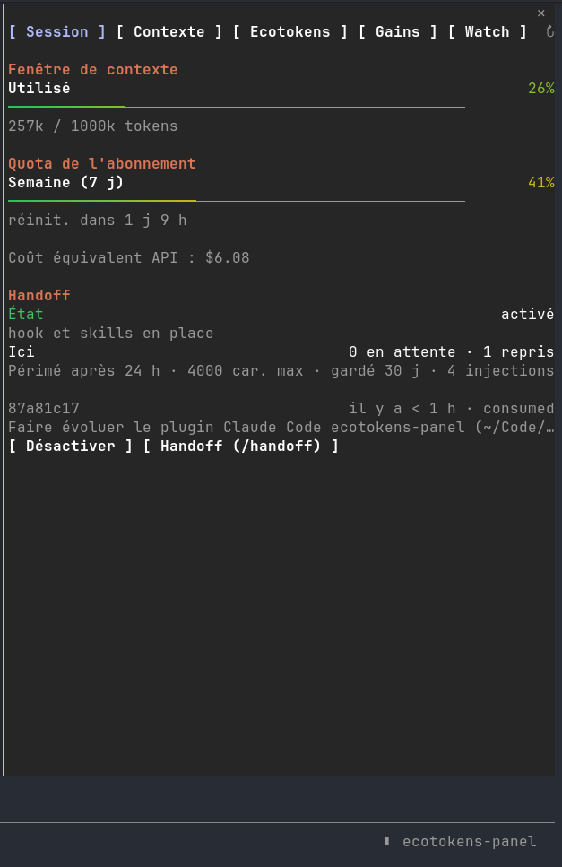
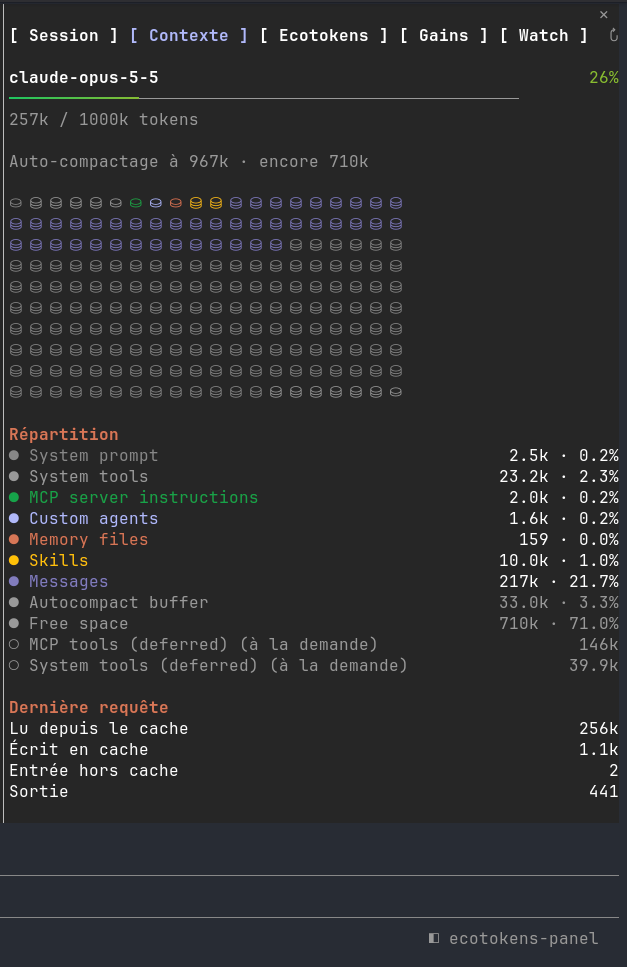
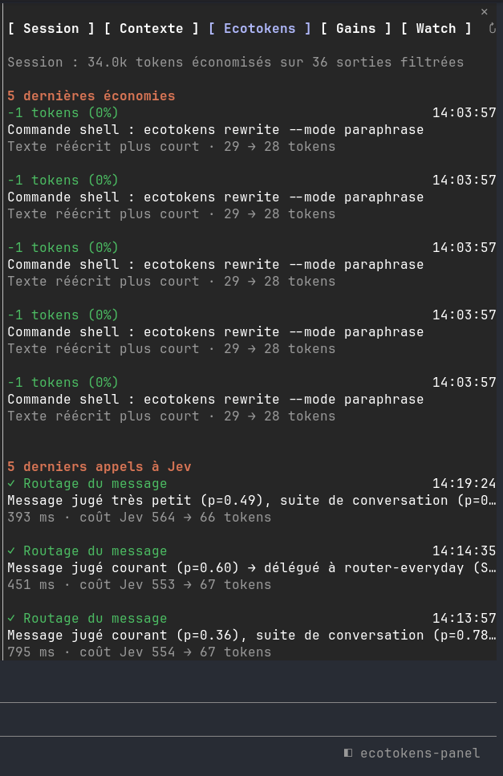
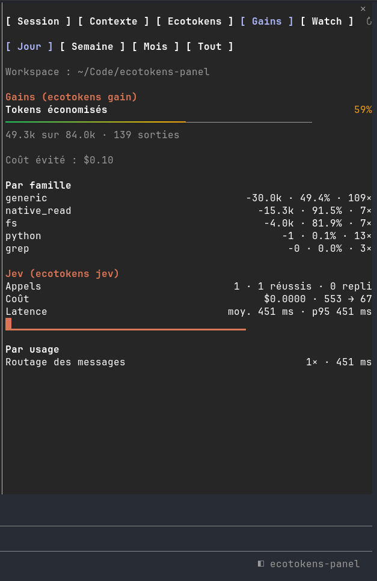
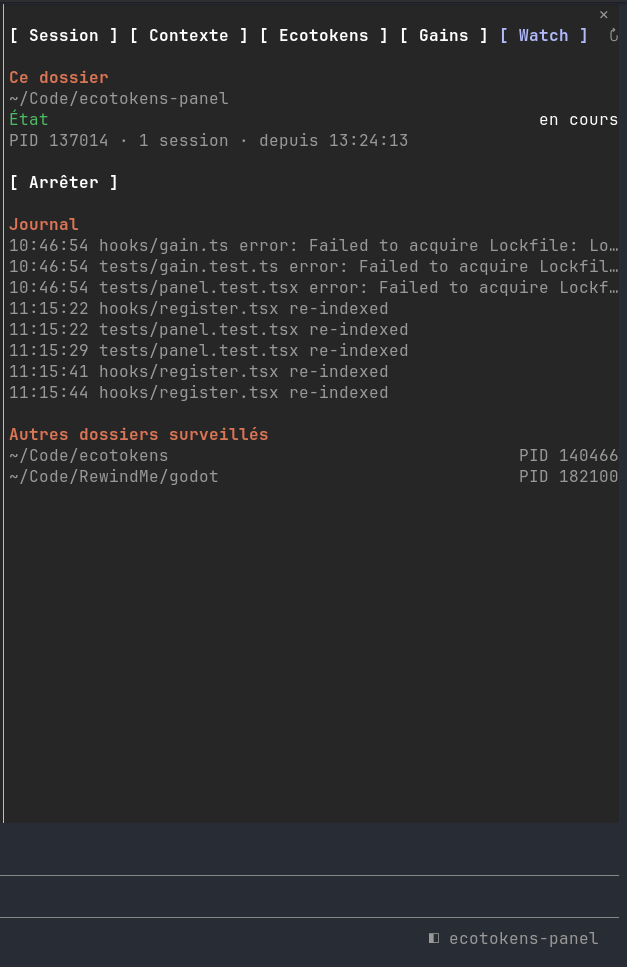

# ecotokens-panel — plugin pour Claude Code

> **Ce plugin est fait pour [Claude Code](https://claude.com/claude-code)**, l'assistant de code en ligne de commande d'Anthropic. Il ne fonctionne pas seul ni dans d'autres outils (Codex, Gemini CLI, Qwen Code…), même si ecotokens les prend en charge.

Un plugin Claude Code qui ajoute un bouton **◧ ecotokens-panel** dans le pied de page et un panneau latéral à onglets autour d'[ecotokens](https://github.com/hansipie/ecotokens) : modèle et effort, contexte et quota de la session, handoff, économies de tokens, usage de Jev, watcher d'index, agents et tâches en arrière-plan de la session.

## Installation

Dans un terminal Claude Code :

```
/plugin install ecotokens-panel --marketplace hansipie/ecotokens-panel
```

Répondez `y` pour ajouter le marketplace, puis choisissez la portée (`user` par défaut). Le plugin est actif tout de suite, sans redémarrage. Installé en portée `user`, il fonctionne aussi dans l'onglet Code de l'application desktop.

### Prérequis

- **Claude Code** (terminal, ou onglet Code de l'application desktop), avec la prise en charge des plugins à hooks (`/plugin`).
- **ecotokens 0.30.0 ou plus récent** dans le `PATH`, avec ses hooks installés (`ecotokens install`). L'onglet Gains utilise l'option `--project` de `ecotokens gain` et `ecotokens jev`, apparue dans cette version. Vérifiez avec `ecotokens --version`.
- **sqlite3** dans le `PATH`, pour l'onglet Ecotokens et les lignes de la conversation, qui lisent les bases d'ecotokens en lecture seule.

Sans ecotokens, les onglets Session, Contexte et Background fonctionnent toujours ; les autres indiquent qu'ils ne peuvent pas lire l'état.

## Utilisation

Ouvrez ou fermez le panneau avec le bouton du pied de page ou la commande `/panel`. Les touches `1` à `6` changent d'onglet (la barre d'onglets passe à la ligne quand le panneau est étroit), `↻` relit tout, `✕` ferme.

| Onglet | Contenu | Commandes |
| --- | --- | --- |
| **Session** (`1`) | En haut, modèle et effort : ligne « Modèle » (haiku, sonnet, opus, fable ; le modèle courant en surbrillance, son nom complet en gris dessous) et ligne « Effort » (les niveaux de la ligne effort de `/config`, sinon low, medium, high, xhigh, max ; le niveau courant en surbrillance, celui de `/config` s'il le donne, sinon le dernier choisi ici). Puis fenêtre de contexte, quota de l'abonnement (5 h, 7 j) avec le coût équivalent API sur la même ligne que le titre ; handoff : état, handoffs du dossier (celui de la session marqué) | Un bouton de modèle ou d'effort lance `/model` ou `/effort` (le bouton s'éclaire au survol) ; `h` active ou désactive le handoff ; « Handoff (/handoff) » lance la skill |
| **Contexte** (`2`) | Détail de la fenêtre comme `/context` : grille, répartition, cache de la dernière requête, fichiers mémoire, serveurs MCP, skills, agents | — |
| **Ecotokens** (`3`) | Économies de la session : les 5 dernières sorties filtrées et les 5 derniers appels à Jev | — |
| **Gains** (`4`) | Pour le workspace courant uniquement : tokens économisés, coût évité, détail par famille ; appels Jev, coût, latence, usages, erreurs, activité | Période : Jour, Semaine, Mois, Tout |
| **Watch** (`5`) | Watcher d'index du dossier : état, PID, sessions, journal ; autres dossiers surveillés | `w` démarre ou arrête le watcher de ce dossier |
| **Background** (`6`) | En-tête : nombre d'agents, de tâches et d'actifs. Section Agents : sous-agents et coéquipiers de la session courante, les actifs en premier : nom ou type, description, statut (`●` en cours, `◌` en attente, `○` inactif, `✓` terminé, `✗` échoué, `■` arrêté), type · coéquipier ou arrière-plan · modèle, temps écoulé (durée une fois fini), « N outils » (appels d'outils de la boucle propre à l'agent, et le dernier tant qu'il tourne), tokens entrée → sortie et coût estimé (`≈ $0.15`, `< $0.01` sous un centime) après une exécution. Section Tâches en arrière-plan : commandes Bash lancées en arrière-plan, Monitor, workflows, agents distants : type, description, commande, statut (en cours, terminé, arrêté), temps écoulé. 30 lignes au plus par section. « Aucun agent ni tâche en arrière-plan dans cette session. » quand il n'y a rien | — |

Les onglets se rafraîchissent à leur ouverture, à la fin de chaque tour tant qu'ils sont affichés, et avec `↻`. L'onglet Background suit en plus chaque lancement d'agent, chaque appel d'outil d'un agent, et relit la liste toutes les 2 s tant qu'il est affiché. Un agent lancé avant le chargement du plugin apparaît sans temps écoulé, et ses compteurs ne partent que de ce chargement.

Claude Code ne donne pas de liste des tâches en arrière-plan aux plugins : une tâche apparaît quand l'outil qui la lance répond (Bash en arrière-plan, Monitor), passe à « arrêté » quand TaskStop l'arrête, et la liste des tâches en cours que portent les événements de fin de tour (Stop, SubagentStop) ajoute celles qui n'ont pas été vues partir (workflows, agents distants) et marque « terminé » celles qui n'y figurent plus. Leur fin n'est donc connue qu'à la fin du tour suivant (d'où la durée « ≤ ») ; leur code de sortie et leur résultat ne sont pas connus. Un agent ou une tâche terminé quitte l'onglet 5 minutes après sa fin (un agent que le moteur liste encore reste).

### Dans la conversation

Sans ouvrir le panneau, le plugin écrit aussi dans la conversation, en gris :

- sous le résultat d'un appel d'outil sur lequel ecotokens a économisé des tokens : `ecotokens · −11.3k tokens (−91 %) · ≈ $0.02`. Sous une série d'appels repliée (« Read 3 files »), une ligne donne la somme : `ecotokens · −6.3k tokens (−90 %) · ≈ $0.01` ;
- à la fin de chaque tour de la conversation principale, l'économie depuis le tour précédent, puis le cumul de la session (ces lignes ne sont que de l'affichage : elles ne sont pas envoyées au modèle) : `ecotokens · −24.1k tokens (−87 %) · ≈ $0.05 · session −312k · ≈ $0.62`. Rien n'est écrit quand ecotokens n'a rien économisé pendant le tour.
- quand un sous-agent délégué par le routeur ecotokens (`router-tiny`, `router-everyday`, `router-large`, `router-hardest`) termine, ses tokens et son coût : `délégation · router-everyday (sonnet-5-5) · 41.0k → 2.0k tokens · ≈ $0.15`. Une ligne par exécution terminée.

Les lignes `ecotokens` ne montrent que l'économie. Le coût évité est calculé comme `ecotokens gain` : tokens économisés ÷ 1 000 000 × `price_input_usd_per_mtok` de `~/.config/ecotokens/config.json` ; sans ce prix, la partie `≈ $` est omise, et sous un centime elle affiche `< $0.01`.

Le coût d'une délégation et celui d'un agent du Background sont des **estimations** : Claude Code ne donne ni coût par exécution ni grille de prix aux plugins, donc `hooks/agents.ts` porte une petite table de prix publics (USD par million de tokens : entrée, sortie, lecture et écriture du cache) pour les familles haiku, sonnet, opus et fable ; elle est approximative et à tenir à jour à la main. Les tokens de cache sont comptés à leur propre tarif. Pour un modèle hors de ces familles, la partie `≈ $` est omise. Comme `ecotokens gain`, les lignes en mode « réécrit » ne sont pas comptées.

ecotokens ne note pas l'identifiant de l'appel d'outil : le plugin rapproche un appel (Bash ou Read) de sa ligne dans `metrics.db` par le texte de la commande (ou `Read <fichier>`) et par l'heure. Deux commandes identiques lancées presque ensemble peuvent donc échanger leur ligne. Les sorties des autres outils ne sont pas rapprochées, et un appel d'une série dépliée n'a pas de ligne. Ces lignes sont relues à la fin de chaque appel d'outil (et 4 s plus tard, pour les lectures que résume ecotokens après coup), puis à la fin de chaque tour : pas de minuteur qui tourne en continu. Sans ecotokens (pas de `~/.config/ecotokens/metrics.db`), rien n'est lancé ni affiché.

Pour les désactiver : `/config`, ligne **Lignes ecotokens dans la conversation** du plugin (option `liveTranscript`, activée par défaut). Le panneau n'est pas touché.

### Captures d'écran

<table>
  <tr>
    <th>Session</th>
    <th>Contexte</th>
    <th>Ecotokens</th>
  </tr>
  <tr>
    <td></td>
    <td></td>
    <td></td>
  </tr>
  <tr>
    <th>Gains</th>
    <th>Watch</th>
    <th></th>
  </tr>
  <tr>
    <td></td>
    <td></td>
    <td></td>
  </tr>
</table>

## Développement

Le plugin est un module de hooks TypeScript (`hooks/register.tsx`) chargé directement par Claude Code : il n'y a rien à compiler.

```bash
claude plugin validate .   # manifeste, marketplace et module
claude plugin test .       # tests de tests/
```

Pour le charger depuis le dossier pendant le développement : `claude --plugin-dir ~/chemin/vers/ecotokens-panel`, puis `/reload-plugins` après chaque modification.

| Fichier | Rôle |
| --- | --- |
| `hooks/register.tsx` | Hooks, commande `/panel`, rendu du panneau et des lignes de la conversation |
| `hooks/eco.ts` | Requêtes sqlite de l'onglet Ecotokens, lignes ecotokens de la conversation (rapprochement appel ↔ économie) |
| `hooks/gain.ts` | `ecotokens gain` / `ecotokens jev` de l'onglet Gains |
| `hooks/handoff.ts` | `ecotokens handoff` du panneau handoff |
| `hooks/watch.ts` | `ecotokens watch` de l'onglet Watch |
| `hooks/agents.ts` | Suivi des agents et des tâches en arrière-plan de l'onglet Background |
| `hooks/bar.ts` | Jauges et dégradé de couleurs |
| `types/index.d.ts` | Contrat des valeurs gardées dans `$.state` |
